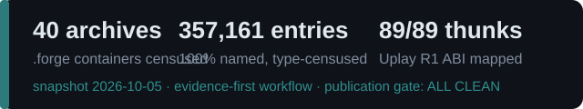
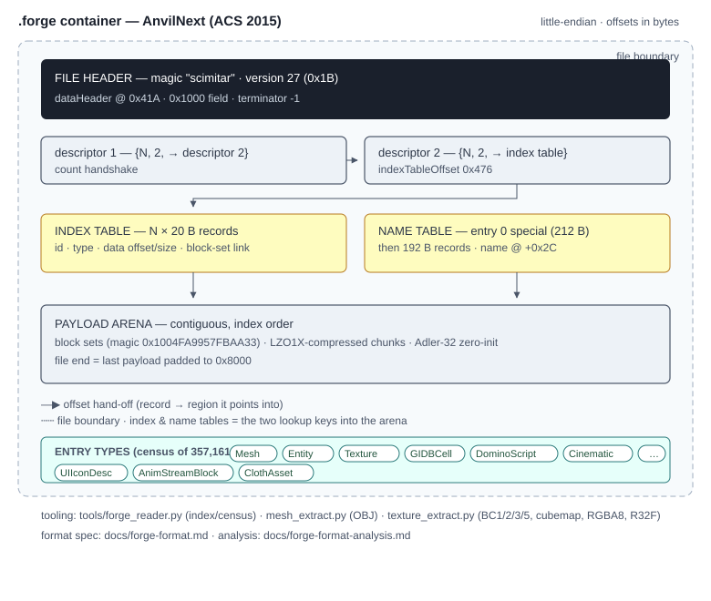

# acs-anvil-research


**Format tooling, specifications, and reverse-engineering notes for
Assassin's Creed Syndicate (AnvilNext, 2015)** — produced by independent
interoperability and security research on a legally owned copy.
Everything here operates on **files you supply**; nothing from the game
ships in this repo.

## Quickstart

```bash
git clone https://github.com/grm2ngo/acs-anvil-research
cd acs-anvil-research

# index a .forge archive (entry census + name table)
python tools/forge_reader.py "path/to/DataPC.forge"

# extract meshes → OBJ / decode textures
python tools/mesh_extract.py --help
python tools/texture_extract.py --help
```

<details>
<summary><b>Example — forge_reader on a 407 MB archive</b> (click)</summary>

```
$ python tools/forge_reader.py DataPC.forge
scimitar v27 · entries 2183 · named 2183 (100.0%)
index 0x476..0xAF16 · names ..0x71516 · payload arena 406.32 MB (100% of file)
type census   ACVI_CHR x418 · ACVI_UIicon x198 · ACVI_UI x191 · ...
  [   0] GlobalMetaFile            id 0x10      212 B   special slot
  [   1] ACVI_CHR_Jacob_Frye       id 0x2C      1.1 MB  3 block-sets
  ...
```
</details>

## The container at a glance





## Contents

| Doc | What you get |
|---|---|
| [`docs/forge-format.md`](docs/forge-format.md) | container spec: header, descriptors, index & name tables |
| [`docs/forge-format-analysis.md`](docs/forge-format-analysis.md) | deep dive: block sets, LZO1X chunks, Adler-32, entry-0 quirk |
| [`docs/uplay-r1-semantics.json`](docs/uplay-r1-semantics.json) | all 89 Uplay R1 exports: thunk targets, arg-register order, referenced names |
| [`docs/steam-ifaces.json`](docs/steam-ifaces.json) | the 9 interfaces the shipped 2014-era `steam_api64` exposes |
| [`docs/iat-analysis.md`](docs/iat-analysis.md) | why this title has no classic IAT — and what that implies |
| [`docs/ubx-packer-architecture.md`](docs/ubx-packer-architecture.md) | behavior notes on the title's custom `.UBX` protector |
| [`docs/methodology/`](docs/methodology) | the evidence-first agent workflow behind every fact here |

<details>
<summary><b>Uplay R1 loader — the 89-thunk architecture</b> (click)</summary>

```
uplay_r1_loader64.dll (unpacked, 89 exports)
   UPLAY_*  ──►  E9 jmp rel32 (5 B thunk)  ──►  internal impl
                                                    │
                          name-dispatch: each impl references the
                          export-name table (see uplay-r1-semantics.json
                          for every mapping + arg-register order)
```
</details>

## Verification discipline

Every fact in `docs/` was produced under an evidence-first workflow —
constants re-derived by computation, cross-checked by independent methods,
adversarially reviewed. `tools/pub_gate.py` is the lint this repo passes
before anything is published (PII / contamination sweep): **ALL CLEAN**.

## Status

Snapshot 2026-10-05, distilled from an active research workspace.
Formats documented at the level the tools exercise (container, index,
name tables, mesh/texture layouts). Deeper entry-type coverage is
ongoing research.

## Legal

- Independent research; **not affiliated with or endorsed by Ubisoft**.
- **No game content is included** — no code, assets, or data derived from
  the game's files. Tools require your own legally obtained copy.
- Published for interoperability and security-research purposes.
- License: MIT (see [`LICENSE`](LICENSE)).
