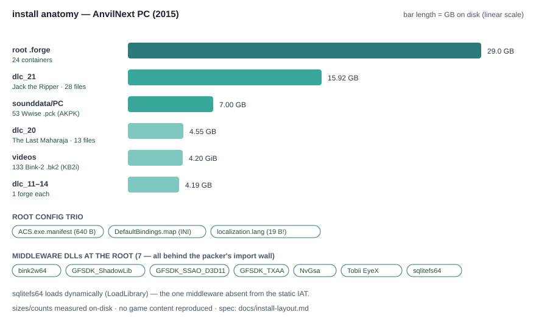

# Install layout — what ships on disk (2015 PC release)

A measured map of the install's data layout: where content lives, what each
area contains, and the small config files at the root. Useful for tool
authors deciding what to read first. All counts/sizes measured on-disk;
magics sampled per file class. For what lives *inside* the 40 `.forge`
containers, see the [forge census](forge-census.md).

## The big blocks

| Area | Contents | Size |
|---|---|---|
| root `DataPC*.forge` | 24 engine containers | ~29 GB |
| `dlc_21/` (Jack the Ripper) | 9 `.forge` + 10 `.pck` + 9 `.bk2` | 15.92 GB |
| `sounddata/PC/` | 53 Wwise packages (`.pck`, magic `AKPK`) | 7.00 GB |
| `dlc_20/` (The Last Maharaja) | 3 `.forge` + 10 `.pck` | 4.55 GB |
| `videos/` | 133 Bink-2 clips (`.bk2`, magic `KB2i`) | 4.20 GiB |
| `dlc_11/`…`dlc_14/` | 1 forge container each | 0.69–1.39 GB each |

Magics: `.forge` → `scimitar` (see the
[container spec](forge-format.md)), `.pck` → `AKPK`, `.bk2` → `KB2i`.

## videos\ in detail

- 85 top-level story/skill cinematics (largest single clip: 256 MB).- 16 language subfolders (`br cn cz de du en fr hu it jp ko mx pl ru sp tw`),
  each normally carrying localized `Epilepsy`, `pc_WarningSaving`,
  `warning_disclaimer` clips.
- **`en\` is the only empty locale folder** — English warnings ride the
  top-level clips. A quirk worth knowing before writing a video packer.

## Root config files (3)

| File | Size | What |
|---|---|---|
| `ACS.exe.manifest` | 640 B | SxS manifest, `dpiAware=true` |
| `DefaultBindings.map` | 18,258 B | INI: `[KeyboardMouse]` header with `VendorID`/`ProductID`, then per-button raw codes (`Button1=259`, `PadUp=3`, `StickLeft=10`, …) |
| `localization.lang` | 19 B | binary locale selector — see the [19-byte spec](localization-lang.md) |

## Middleware DLLs at the root (7, by role)

| DLL | Role |
|---|---|
| `bink2w64.dll` | Bink 2 v1.995b video decoder (`Bink*` exports) |
| `GFSDK_ShadowLib.win64.dll` | NVIDIA contact-hardening shadows |
| `GFSDK_SSAO_D3D11.win64.dll` | NVIDIA HBAO+ 3.0 |
| `GFSDK_TXAA.win64.dll` | NVIDIA TXAA |
| `NvGsa.x64.dll` | NVIDIA GSA options helper |
| `Tobii.EyeX.Client.dll` | Tobii EyeX eye-tracking SDK (565 exports) |
| `sqlitefs64.dll` | Ubisoft SQLiteFS big-file library (93 `bf_*` exports) |

All seven are behind the packer's import wall (see
[`exe-surface.md`](exe-surface.md) and [`iat-analysis.md`](iat-analysis.md));
`sqlitefs64` additionally loads dynamically rather than via the IAT.

No original file from the install is reproduced here — counts, sizes, names
of *containers*, and header facts only.
